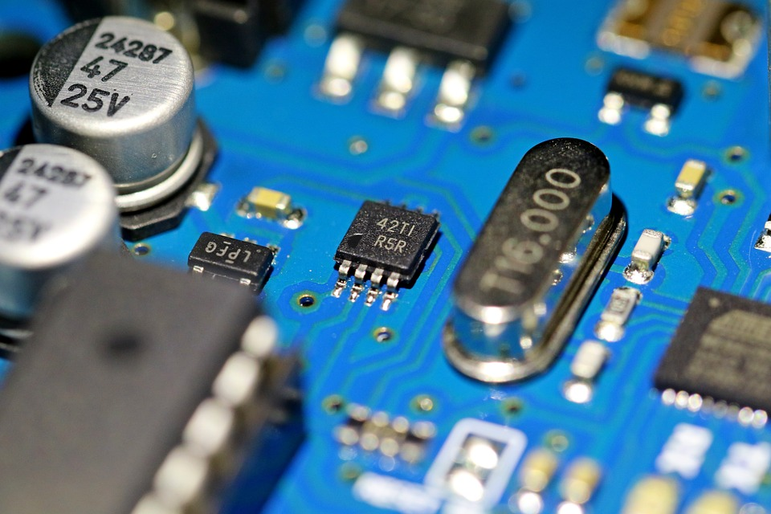

<a id="readme-top"></a>

<!-- PROJECT LOGO -->
<br />
<div align="center">
  <a href="https://github.com/github_username/repo_name">
    
  </a>

<h3 align="center">Arduino easy sketch</h3>

  <p align="center">
    Arduino C++ development workflow/kickstart for Linux.
  </p>
</div>


<!-- TABLE OF CONTENTS -->
<details>
  <summary>Table of Contents</summary>
  <ol>
    <li>
      <a href="#about-the-project">About The Project</a>
      <ul>
        <li><a href="#built-with">Built With</a></li>
      </ul>
    </li>
    <li>
      <a href="#getting-started">Getting Started</a>
      <ul>
        <li><a href="#prerequisites">Prerequisites</a></li>
        <li><a href="#installation">Installation</a></li>
      </ul>
    </li>
    <li><a href="#usage">Usage</a></li>
    <li><a href="#roadmap">Roadmap</a></li>
    <li><a href="#contributing">Contributing</a></li>
    <li><a href="#license">License</a></li>
    <li><a href="#contact">Contact</a></li>
    <li><a href="#acknowledgments">Acknowledgments</a></li>
  </ol>
</details>

<!-- ABOUT THE PROJECT -->
## About The Project
<p align="center">
  
</p>

I started to learn arduino because I know C pretty well and saw a lot of demand on embeded C developer jobs.

What I didn't like was using ArduinoIDE. I know it is best way to program arduino for most people, but I like to do my work in neovim. As I started to create my project, adapting it for lsp to correctly understand, installing libraries and so on, I realized this might get useful for more people than just me.

So this project tries to make it easy for you to create Arduino project, edit it and compile it. Loading it into physical arduino is your job. It is mainly tested in neovim, but vscode or whatever you use should be able to work with this in the same way, if you use lsp. I am personally using Void Linux, so I am primarely developing it for it, but I am trying to make it work on most major distributions.

 <p>> **Note:** If you know your lsp uses specifically gcc or libc, you can install just that one. (If you know some bash and your package manager, you will be able to use this even if your distro is not supported by this repo)</p>

<p align="right">(<a href="#readme-top">back to top</a>)</p>


### Built With

* [![tool][tool.com]][actual-link]

<p align="right">(<a href="#readme-top">back to top</a>)</p>


<!-- GETTING STARTED -->
## Getting Started

Intro text

### Prerequisites
#### packages/binaries on different distributions


| package name | package manager | command to install                  |
|:------------:|:---------------:|:-----------------------------------:|
| arduino-cli  | xbps            | `sudo xbps-install -Su arduino-cli` |
| avr-gcc      | xbps            | `sudo xbps-install -Su avr-gcc`     |
| avr-libc     | xbps            | `sudo xbps-install -Su avr-libc`    |

<p>> **Note:** If you know your lsp uses specifically gcc or libc, you can install just that one.</p>

  <summary>Ubuntu</summary>
  <ol>
    <li>
      arduino-cli
    </li>
    <li>
      avr-gcc
    </li>
    <li>
      avr-libc 
    </li>
      </ol>
</details>

Void Linux ....

### Installation

1. first step
2. second step
   ```sh
   something
   ```
<p align="right">(<a href="#readme-top">back to top</a>)</p>


## Usage

TUTORIAL HERE

_For more examples, please refer to the [Documentation](https://example.com)_

<p align="right">(<a href="#readme-top">back to top</a>)</p>

## Roadmap

- [x] Void Linux + Arduino Uno
- [ ] finish README.md and other repo stuff
- [ ] add support for
    - [ ] Arch linux
    - [ ] Ubuntu
    - [ ] Debian

See the [open issues](https://github.com/github_username/repo_name/issues) for a full list of proposed features (and known issues).

<p align="right">(<a href="#readme-top">back to top</a>)</p>


<!-- CONTRIBUTING -->
## Contributing

Contributions are what make the open source community such an amazing place to learn, inspire, and create. Any contributions you make are **greatly appreciated**.

If you have a suggestion that would make this better, please fork the repo and create a pull request. You can also simply open an issue with the tag "enhancement".
Don't forget to give the project a star! Thanks again!

1. Fork the Project
2. Create your Feature Branch (`git checkout -b feature/AmazingFeature`)
3. Commit your Changes (`git commit -m 'Add some AmazingFeature'`)
4. Push to the Branch (`git push origin feature/AmazingFeature`)
5. Open a Pull Request

<p align="right">(<a href="#readme-top">back to top</a>)</p>


<!-- LICENSE -->
## License

<!-- Distributed under the MIT License. See `LICENSE.txt` for more information. -->

<p align="right">(<a href="#readme-top">back to top</a>)</p>

## Contact

Your Name - [@twitter_handle](https://twitter.com/twitter_handle) - email@email_client.com

Project Link: [https://github.com/github_username/repo_name](https://github.com/github_username/repo_name)

<p align="right">(<a href="#readme-top">back to top</a>)</p>

[contributors-shield]: https://img.shields.io/github/contributors/github_username/repo_name.svg?style=for-the-badge
[contributors-url]: https://github.com/github_username/repo_name/graphs/contributors
[forks-shield]: https://img.shields.io/github/forks/github_username/repo_name.svg?style=for-the-badge
[forks-url]: https://github.com/github_username/repo_name/network/members
[stars-shield]: https://img.shields.io/github/stars/github_username/repo_name.svg?style=for-the-badge
[stars-url]: https://github.com/github_username/repo_name/stargazers
[issues-shield]: https://img.shields.io/github/issues/github_username/repo_name.svg?style=for-the-badge
[issues-url]: https://github.com/github_username/repo_name/issues
[license-shield]: https://img.shields.io/github/license/github_username/repo_name.svg?style=for-the-badge
[license-url]: https://github.com/github_username/repo_name/blob/master/LICENSE.txt

this readme was made with [Best-README-Template](https://github.com/othneildrew/Best-README-Template)
